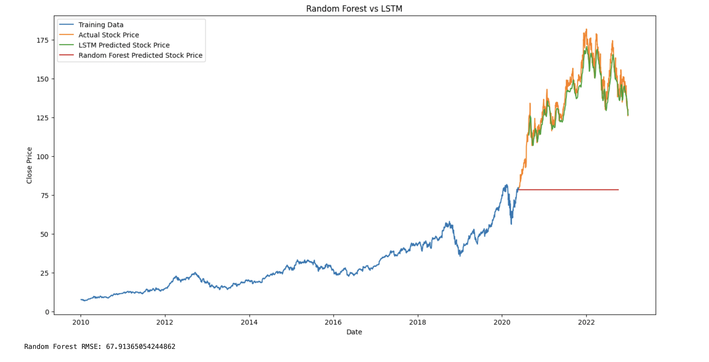

# Stock Price Prediction Using LSTM and Random Forest

This project demonstrates stock price prediction for Apple Inc. (AAPL) using historical data from Yahoo Finance. The project compares the performance of a Long Short-Term Memory (LSTM) neural network with a Random Forest regression model.

## Project Structure:
- `stock-prediction.ipynb`: Notebook demonstrating model building, training, and evaluation.
- `README.md`: This file.

## Features:
- Fetches historical stock data from Yahoo Finance.
- Preprocesses the data using scaling and sequence generation for time series analysis.
- Implements and tunes an LSTM model for stock price prediction.
- Compares the LSTM model with a Random Forest model.
- Evaluates both models using RMSE and visualizes the predicted and actual stock prices.
- Provides future stock price predictions based on the last 60 days of data.

## Screenshot:
<p align="center">
  
</p>

## Prerequisites:
- Python 3.x
- Pandas
- Numpy
- Scikit-learn
- TensorFlow/Keras
- Matplotlib
- yfinance
- RandomForestRegressor (from Scikit-learn)

## Instructions:
1. **Clone the repository:**
```bash
git clone https://github.com/yajkotak/stock-price-prediction.git
```

2. **Install required dependencies:**
```bash
pip install -r requirements.txt
```
3. **Run the notebook to train the models and visualize the predictions.**

## Dataset:
The dataset used in this project is from Yahoo Finance and contains Apple Inc. stock prices from 2010 to 2023. 

## Results:
- The LSTM model outperformed the Random Forest model with a lower RMSE.
- Predictions of future stock prices showed accurate trends using LSTM.

## License:
This project is licensed under the MIT License.


